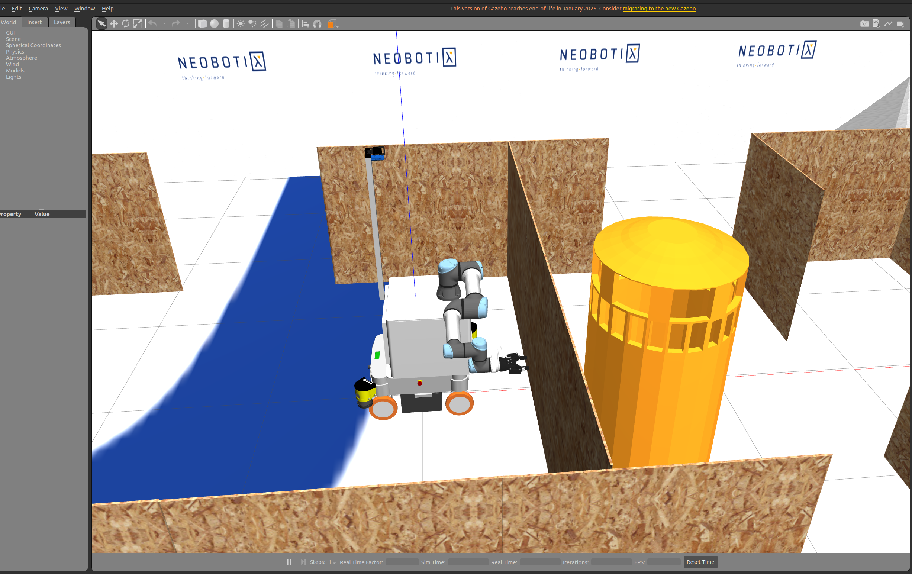
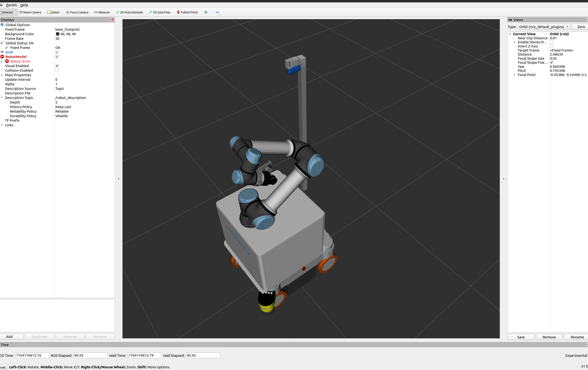

# steve_simulation

**Gazebo Simulation Package** for the Steve Butler robot.

This package provides high-fidelity simulation environments and robot descriptions to test navigation, manipulation, and perception algorithms before deploying them to the real hardware.

## How to Run the Simulation

### 1. Basic Launch
Launch the default simulation environment with the robot spawned:

```bash
ros2 launch steve_simulation simulation.launch.py
```

### 2. Launch with Custom Configuration
You can customize the robot and environment using launch arguments:

```bash
ros2 launch steve_simulation simulation.launch.py \
    world:=neo_workshop \
    arm_type:=ur5e \
    include_pan_tilt:=true
```

### 3. Localization & SLAM in Simulation
To test the full navigation stack, use the launch files provided in `steve_navigation`.

**Simulate Localization (AMCL):**
```bash
ros2 launch steve_navigation localization.launch.py use_sim_time:=true map:=/path/to/your/map.yaml
```

**Simulate SLAM (Mapping):**
```bash
ros2 launch steve_navigation slam.launch.py use_sim_time:=true
```

---

## Troubleshooting

### Models Not Loading ("White Box" Robot)
If the robot appears as a white box or collada meshes are missing:
1. Ensure you have cloned all submodules: `git submodule update --init --recursive`
2. Source the workspace: `source install/setup.bash`
3. Ensure the `GAZEBO_MODEL_PATH` includes your workspace:
   ```bash
   export GAZEBO_MODEL_PATH=$GAZEBO_MODEL_PATH:$(pwd)/src/steve_simulation/models
   ```

### "Missing model.config" Errors
This is a common warning in Gazebo when it tries to fetch models from the online database. It usually doesn't affect the simulation if your local models are correct. To suppress it, you can disable the online model database in `~/.gazebo/gui.ini`.

### RealSense Camera Not Publishing
The simulation uses a plugin to simulate the RealSense L515.
- Check if the plugin is loaded: `ros2 topic list | grep camera`
- If topics are missing, ensure `steve_essentials` dependencies are installed.

---

## Visuals



---

**Note**: This simulation environment has been migrated to support modern Gazebo features while maintaining compatibility with classic workflows.

---

### Acknowledgements
- **Rohit Menon** - For mentorship and technical guidance on Neobotix platforms.
- **Prof. Maren Bennewitz** - Head of the Humanoid Robots Lab, University of Bonn.
